.. -----------------------------------------------------------------------------
   ..
   ..  Filename       : index.rst
   ..  Author         : Huang Leilei
   ..  Status         : phase 000
   ..  Created        : 2023-09-12
   ..  Description    : description about 第02讲 - 逻辑代数基础 - 基本定理
   ..
.. -----------------------------------------------------------------------------

第02讲 - 逻辑代数基础 - 基本定理
--------------------------------------------------------------------------------

.. image:: 幻灯片1.JPG

基本公式
........................................
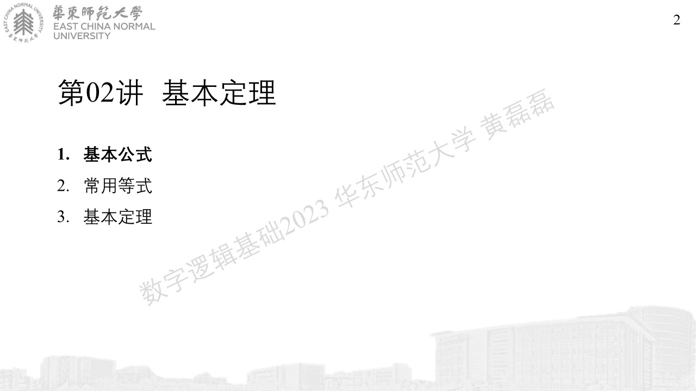
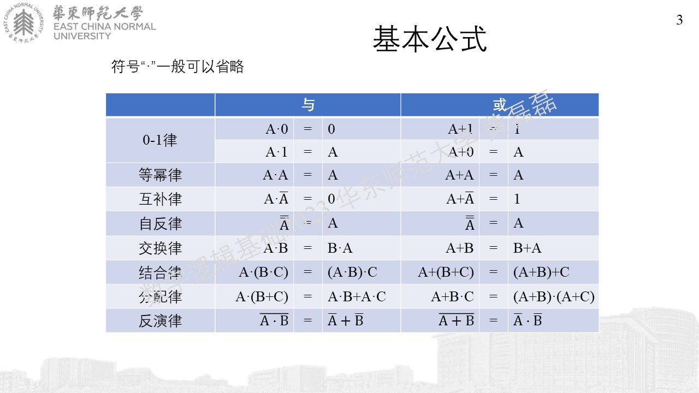
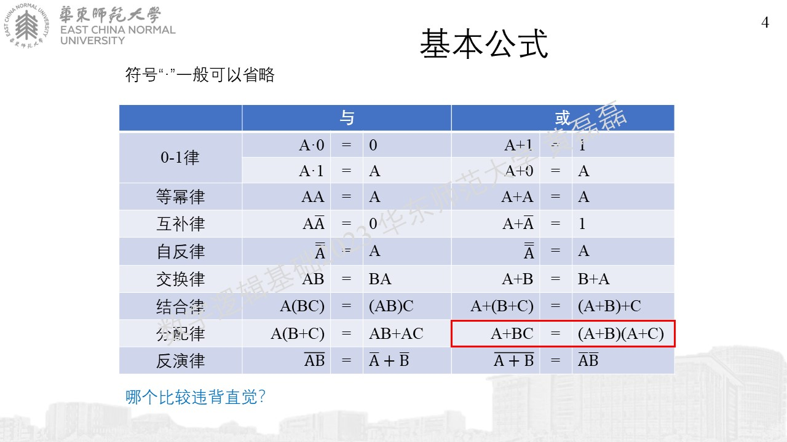
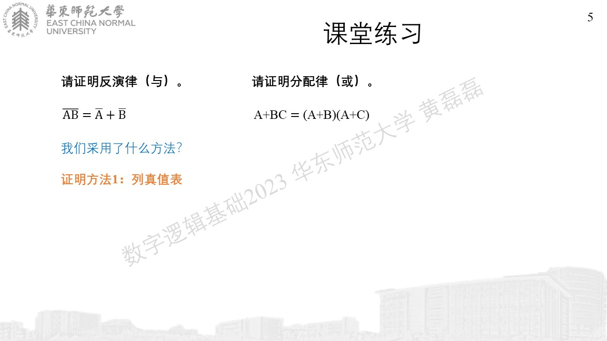

常用等式
........................................
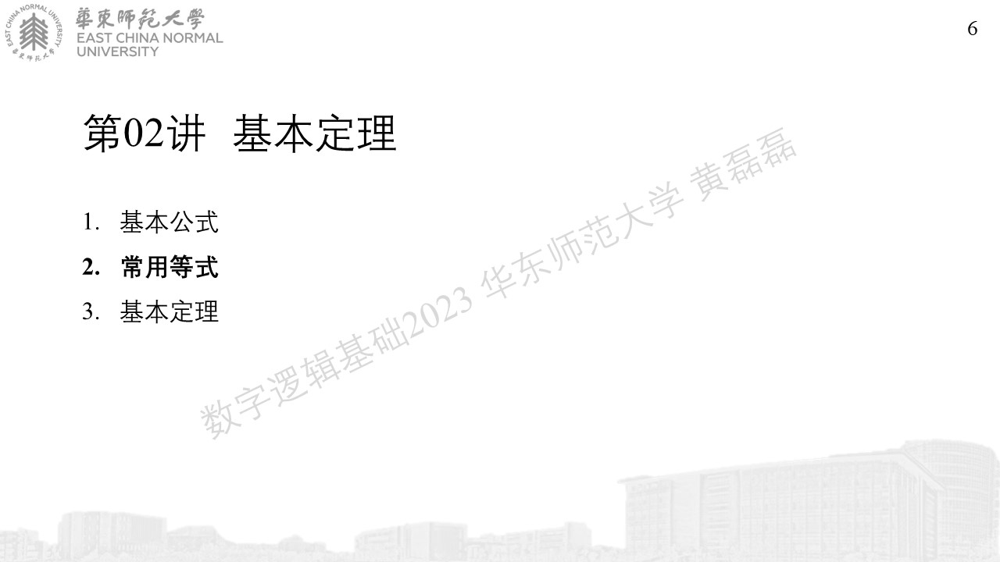
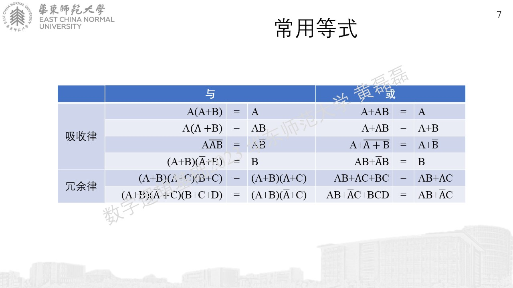
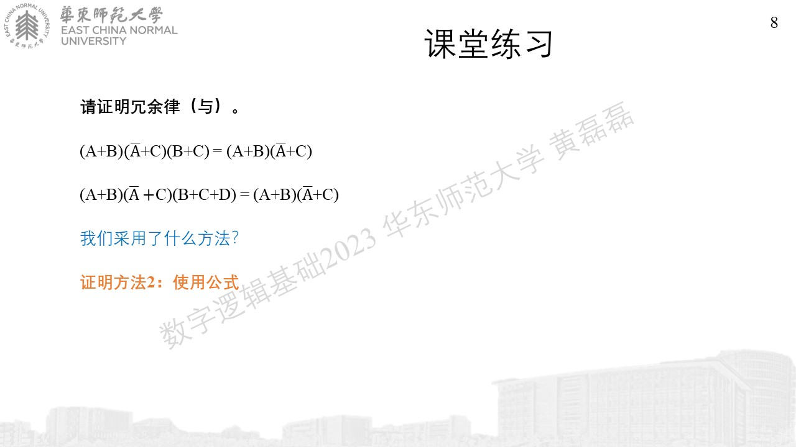

基本定理
........................................
.. image:: 幻灯片9.JPG
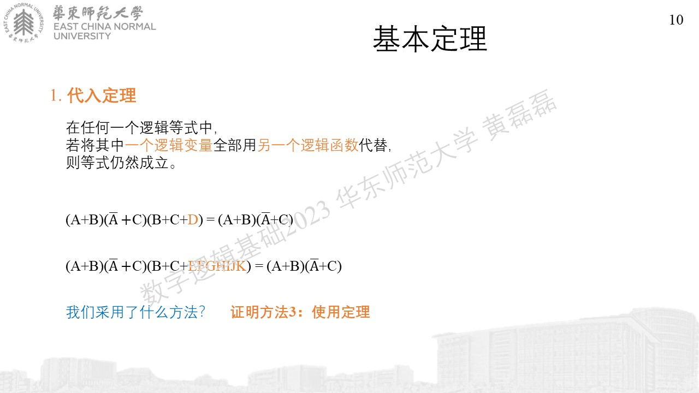
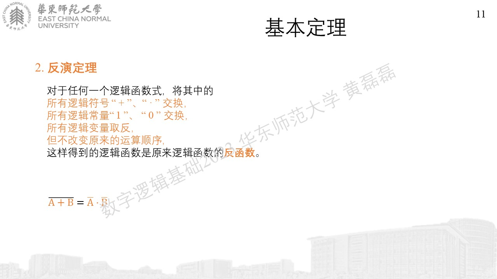
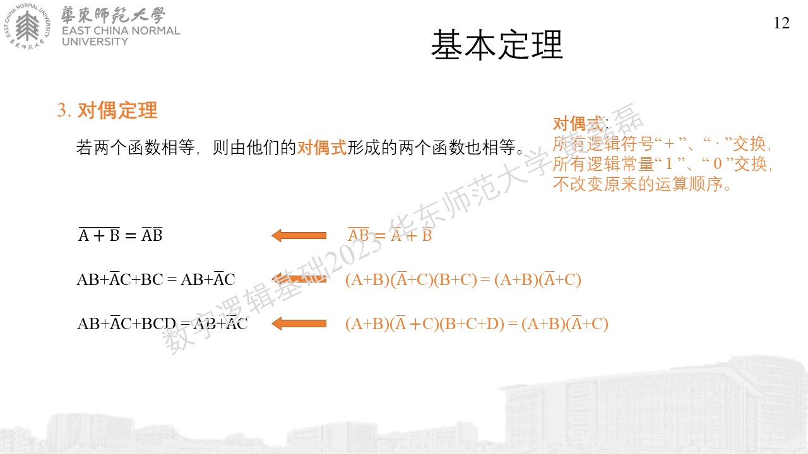
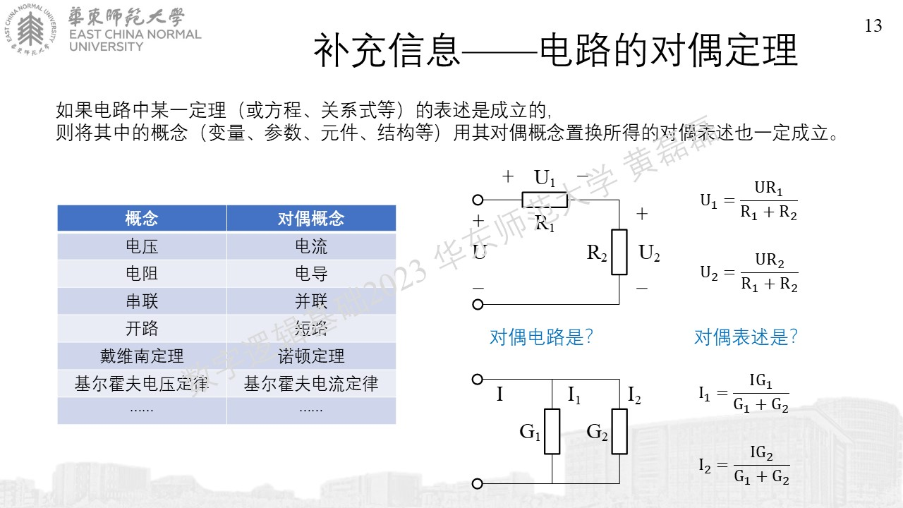
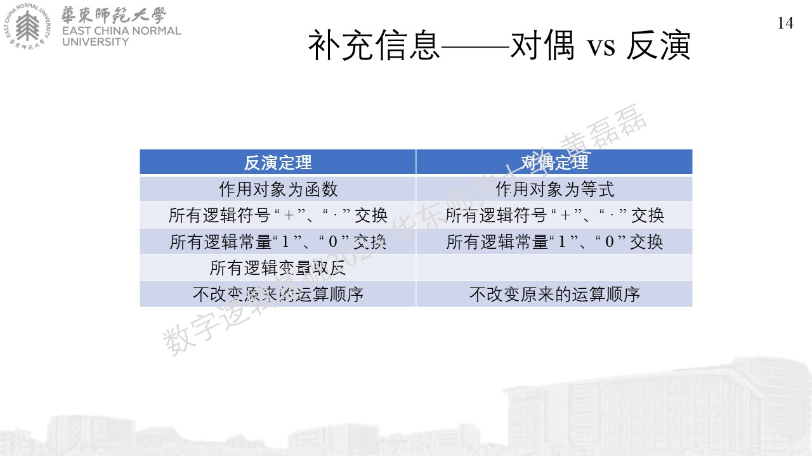
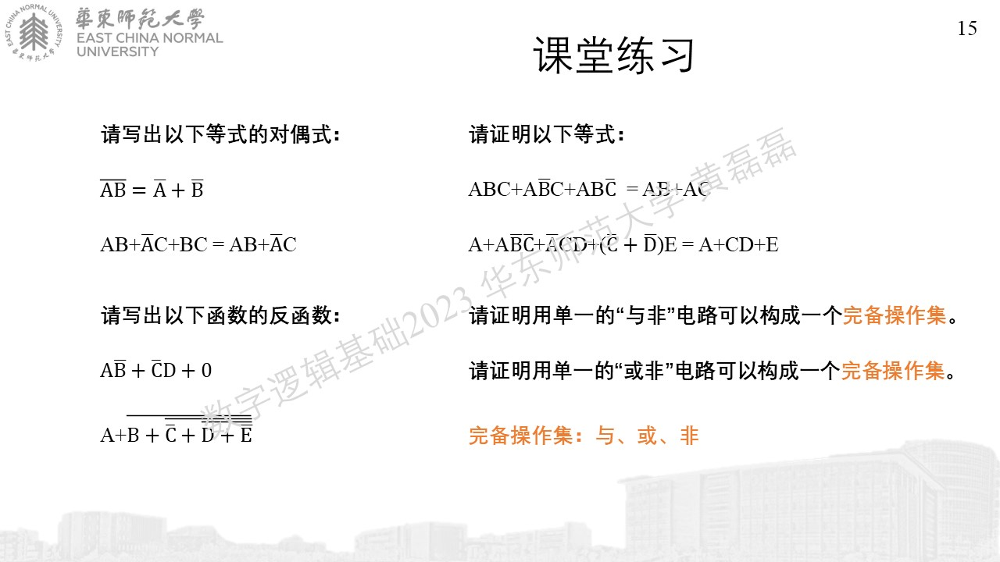
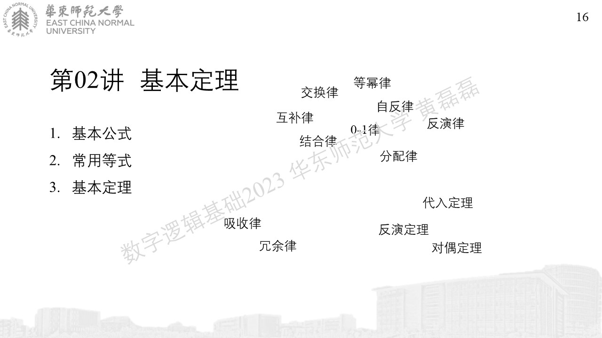
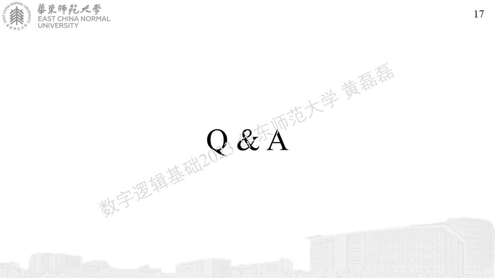
