.. -----------------------------------------------------------------------------
   ..
   ..  Filename       : index.rst
   ..  Author         : Huang Leilei
   ..  Status         : phase 000
   ..  Created        : 2023-10-10
   ..  Description    : description about 第06讲 - 组合逻辑电路 - 电路的设计(补充部分)(Booth2)
   ..
.. -----------------------------------------------------------------------------

第06讲 - 组合逻辑电路 - 电路的设计(补充部分)(Booth2)
--------------------------------------------------------------------------------

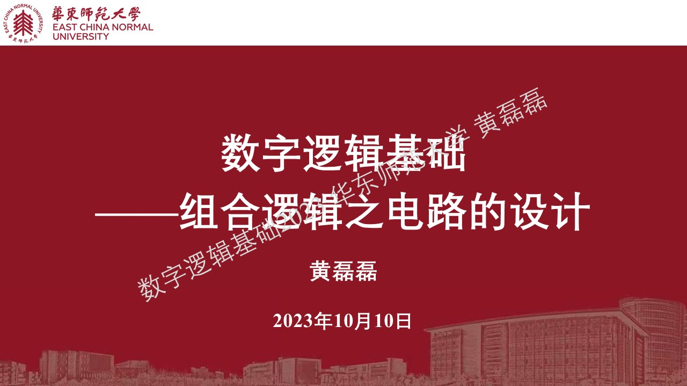
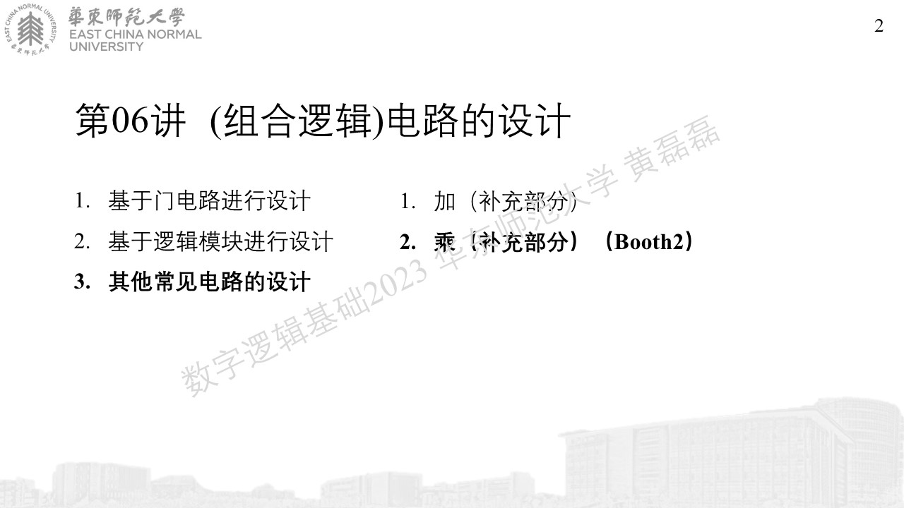

其他常见电路的设计(乘)(全正)
........................................
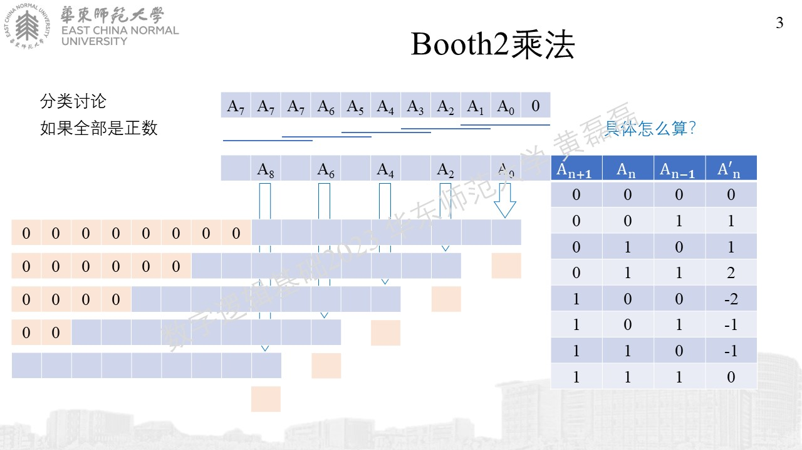
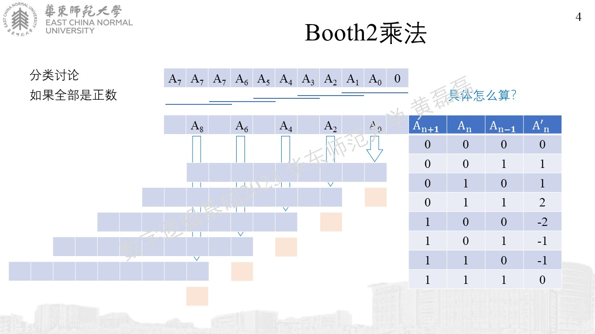

其他常见电路的设计(乘)(全负)
........................................

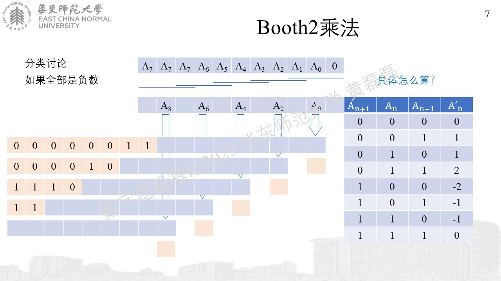

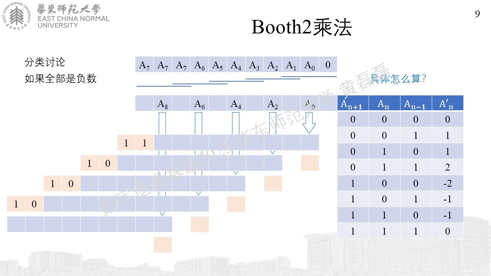

其他常见电路的设计(乘)(正负)(1)
........................................

其他常见电路的设计(乘)(正负)(2)
........................................
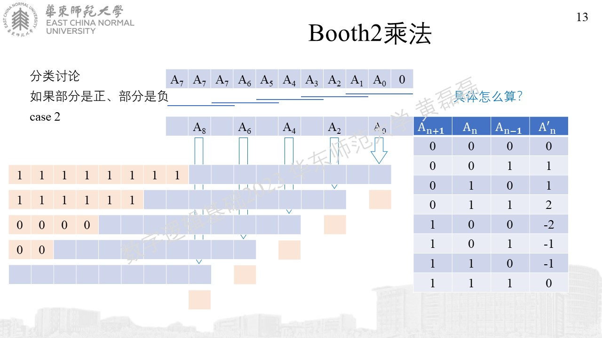

其他常见电路的设计(乘)(正负)(3)
........................................

其他常见电路的设计(乘)(正负)(4)
........................................

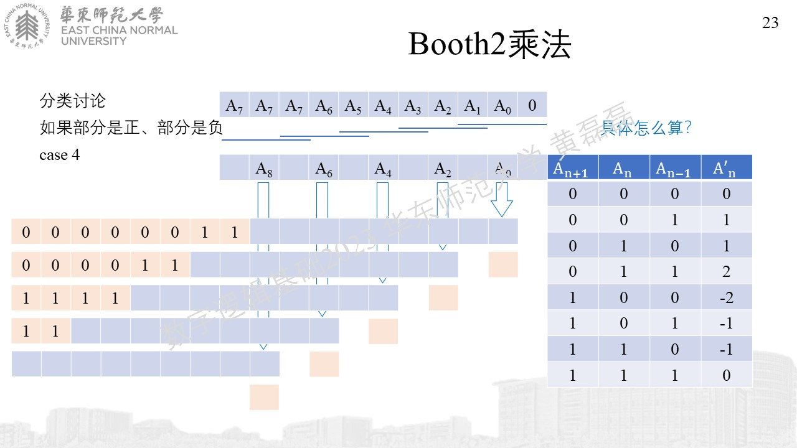

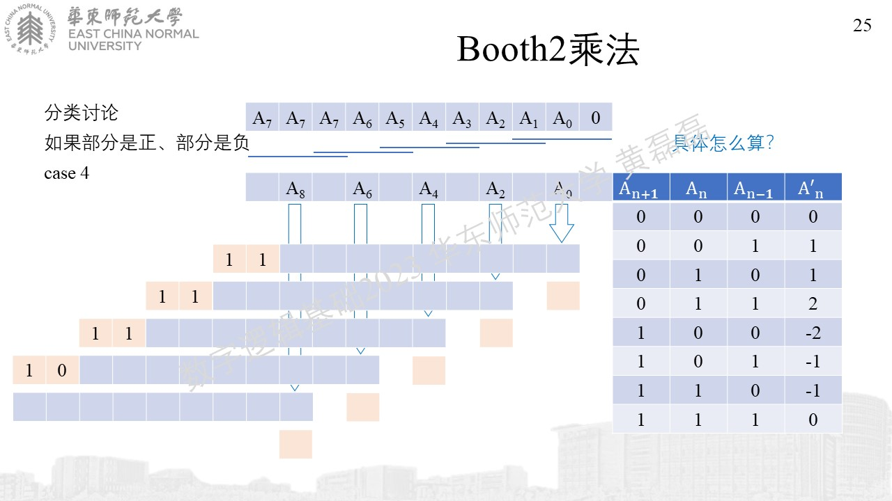

其他常见电路的设计(乘)(正负)(5)
........................................

其他常见电路的设计(乘)(总结)
........................................
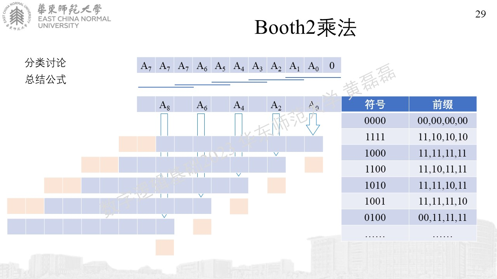
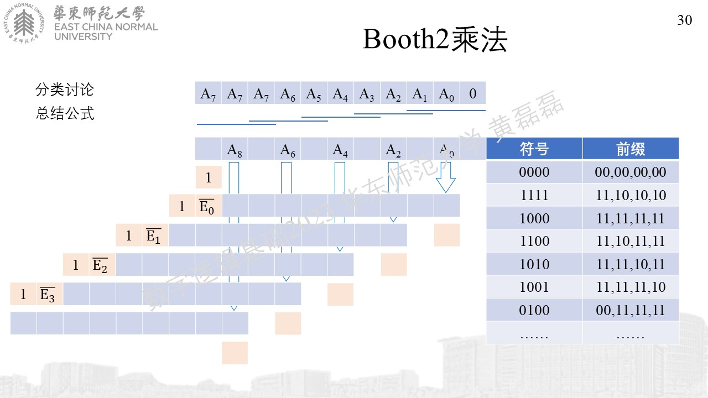
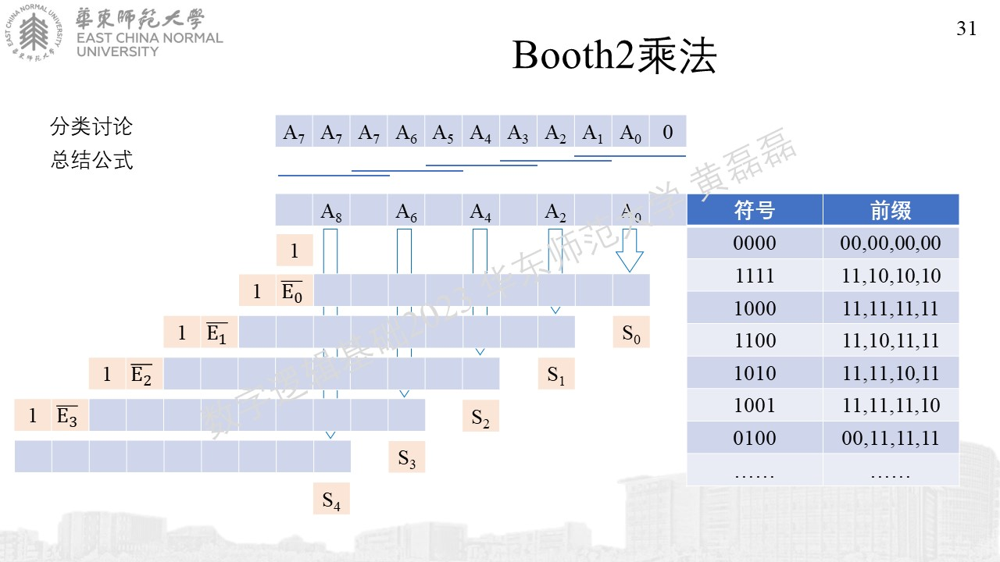
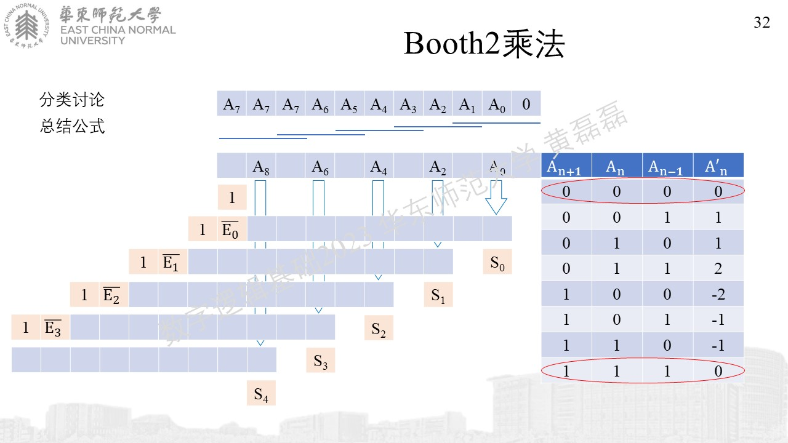
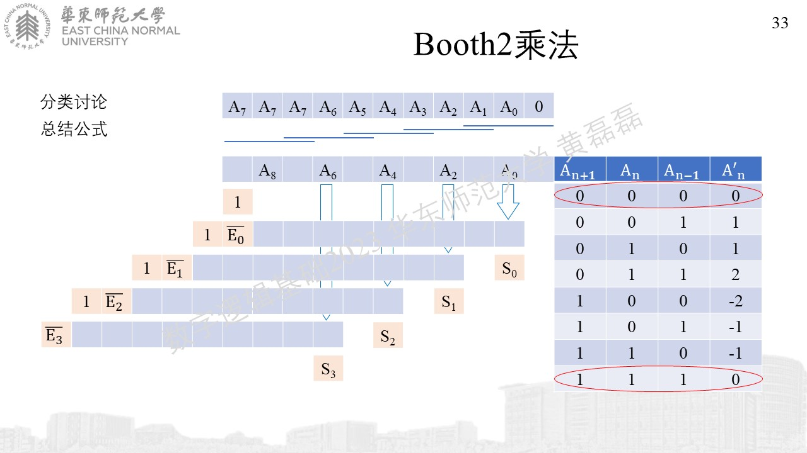
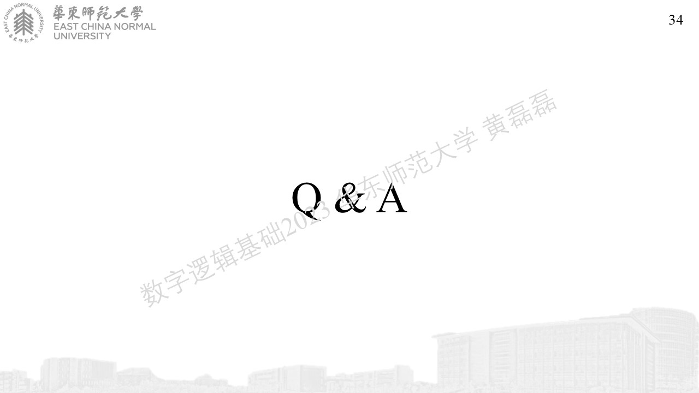
