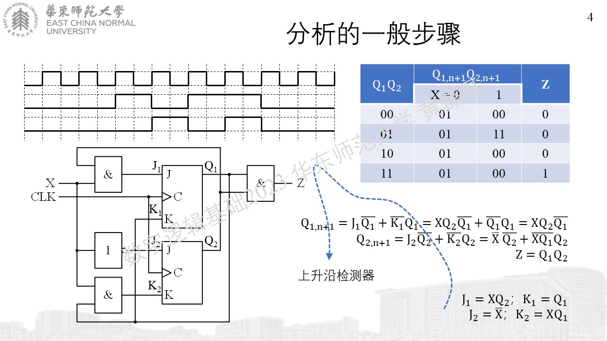
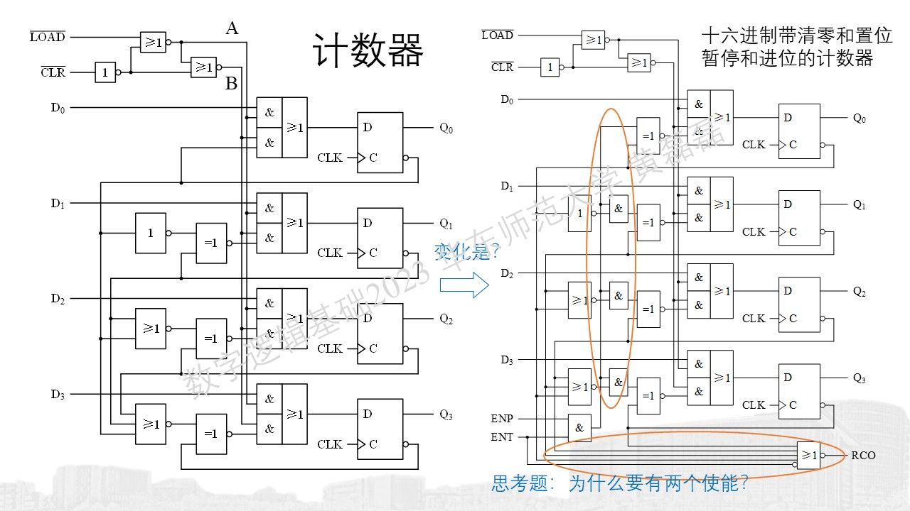

.. -----------------------------------------------------------------------------
   ..
   ..  Filename       : index.rst
   ..  Author         : Huang Leilei
   ..  Status         : phase 000
   ..  Created        : 2023-10-10
   ..  Description    : description about 第12讲 - 同步时序(状态机) - 电路的分析
   ..
.. -----------------------------------------------------------------------------

第12讲 - 同步时序(状态机) - 电路的分析
--------------------------------------------------------------------------------

分析的一般过程
........................................

常见电路的分析
........................................

未完待续...
