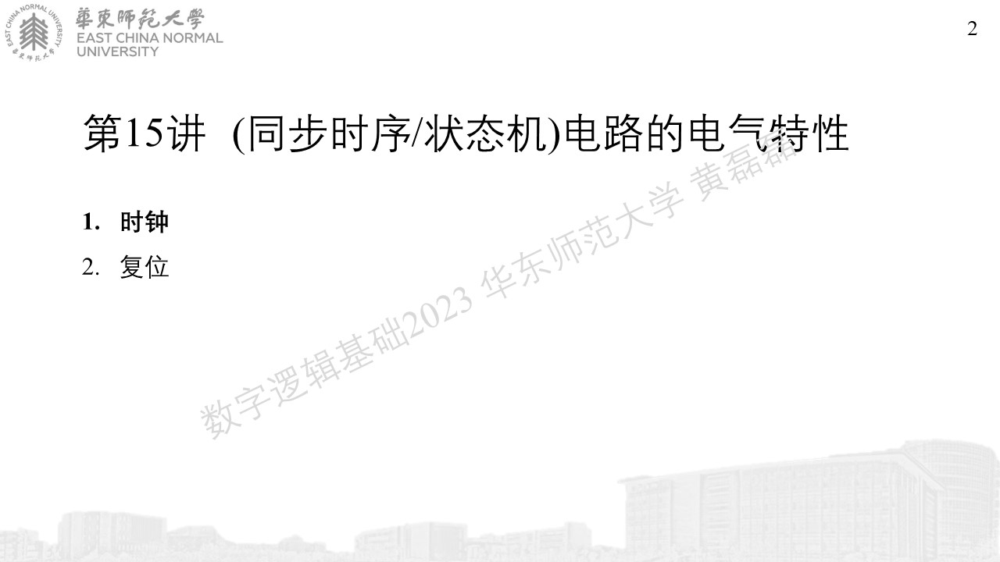
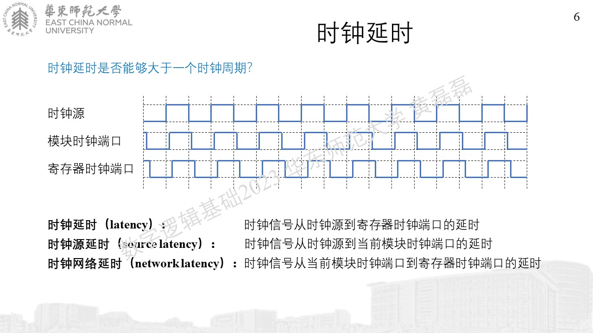
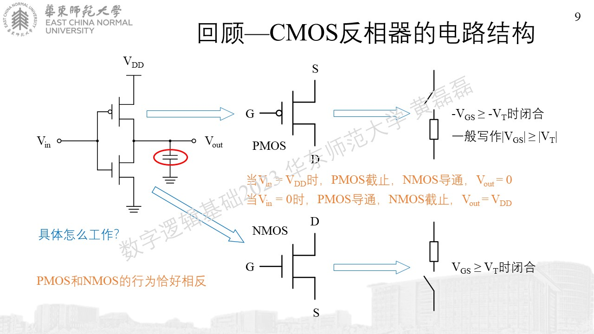
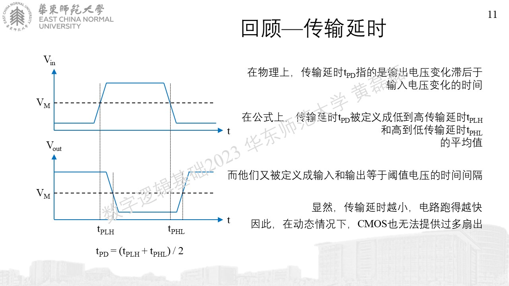
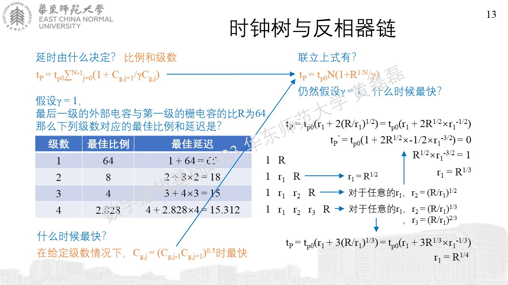
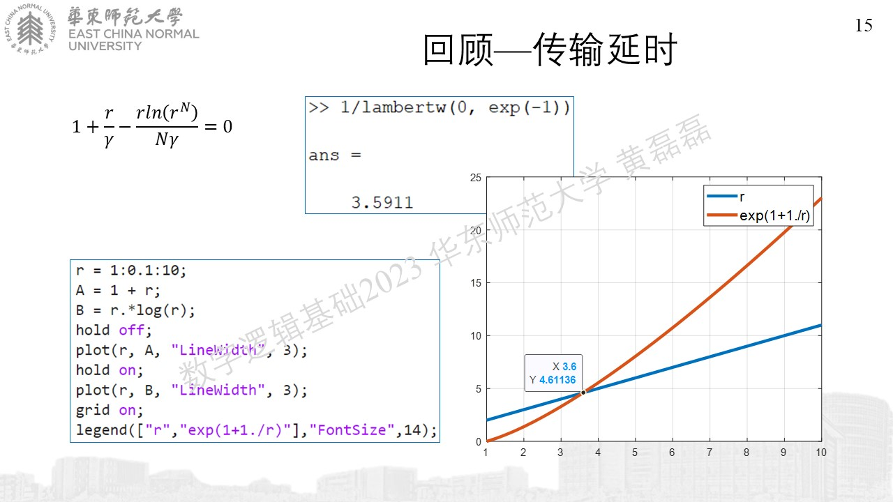

.. -----------------------------------------------------------------------------
   ..
   ..  Filename       : index.rst
   ..  Author         : Huang Leilei
   ..  Status         : phase 000
   ..  Created        : 2023-11-28
   ..  Description    : description about 第15讲 - 同步时序(状态机) - 电路的电气特性
   ..
.. -----------------------------------------------------------------------------

第15讲 - 同步时序(状态机) - 电路的电气特性
--------------------------------------------------------------------------------

时钟
........................................

未完待续

..

   复位
   ........................................
   .. image:: 幻灯片17.JPG
   .. image:: 幻灯片18.JPG
   .. image:: 幻灯片19.JPG
   .. image:: 幻灯片20.JPG
   .. image:: 幻灯片21.JPG
   .. image:: 幻灯片22.JPG
   .. image:: 幻灯片23.JPG
